# NewCare

NewCare é um aplicativo mobile desenvolvido como projeto acadêmico para apoiar a criação e o acompanhamento de hábitos saudáveis. A proposta do app é transformar pequenas ações do dia a dia em missões, usando elementos de gamificação como XP, níveis, moedas, conquistas e sequência de dias para incentivar o usuário a manter uma rotina melhor.

O aplicativo trabalha com quatro áreas principais de cuidado:

- Saúde mental
- Saúde física
- Lazer
- Sono

Após o login, o usuário passa por um onboarding simples, informa sua área de foco, tempo disponível por dia e nível atual. Com essas informações, o app gera missões personalizadas e acompanha o progresso ao longo do uso.

---

## Como Rodar o Projeto com Expo

1. **Pré-requisitos:**
   - Ter o Node.js instalado, de preferência na versão LTS.
   - Ter o npm instalado. Ele normalmente já vem junto com o Node.js.
   - Ter o Git instalado.
   - Para testar no celular, instalar o aplicativo Expo Go.
   - Para testar em emulador Android, ter o Android Studio configurado.
   - Para testar no simulador iOS, é necessário usar macOS com Xcode instalado.

2. **Clone o repositório:**

   ```bash
   git clone https://github.com/jefbiel/NewCare_Sprint3.git
   cd NewCare_Sprint3/newcare
   ```

3. **Instale as dependências do projeto:**

   ```bash
   npm install
   ```

4. **Inicie o projeto com Expo:**

   ```bash
   npx expo start -c
   ```

5. **Escolha onde executar o app:**
   - Pressione `a` no terminal para abrir no emulador Android.
   - Pressione `i` no terminal para abrir no simulador iOS.
   - Pressione `w` no terminal para abrir a versão web.
   - Escaneie o QR Code com o app Expo Go para abrir no celular.

Também é possível usar os scripts do projeto:

```bash
npm run android
npm run ios
npm run web
```

Observação: os comandos acima devem ser executados dentro da pasta `newcare`.

---

## Screenshots

As imagens do app ficam em [`newcare/docs/screenshots`](newcare/docs/screenshots). A galeria abaixo mostra os principais fluxos e estados visuais do NewCare.

### Fluxo principal

| Login | Início | Missões |
| --- | --- | --- |
| 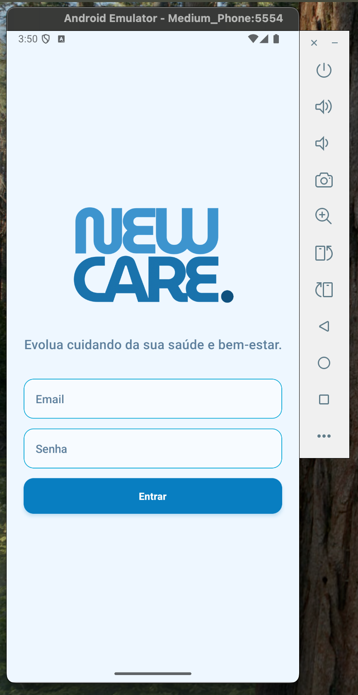 | 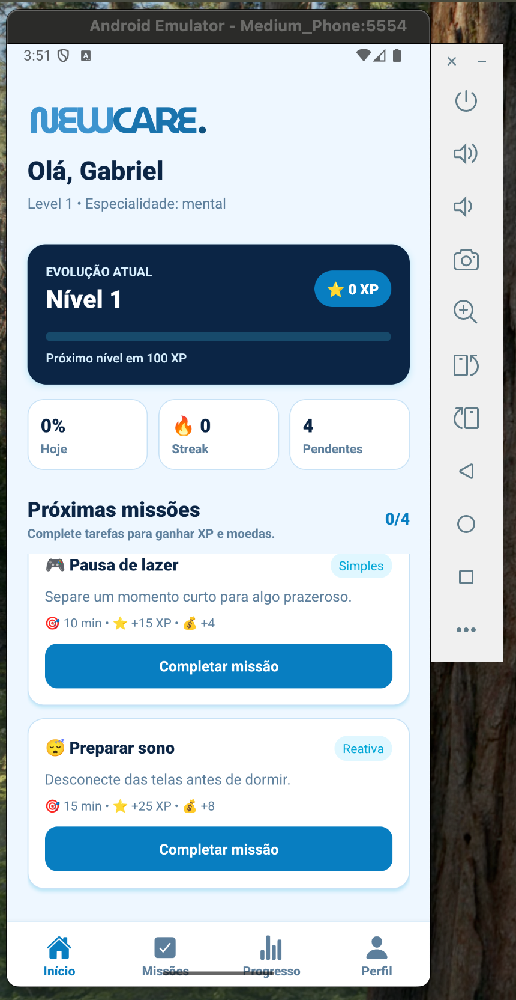 | 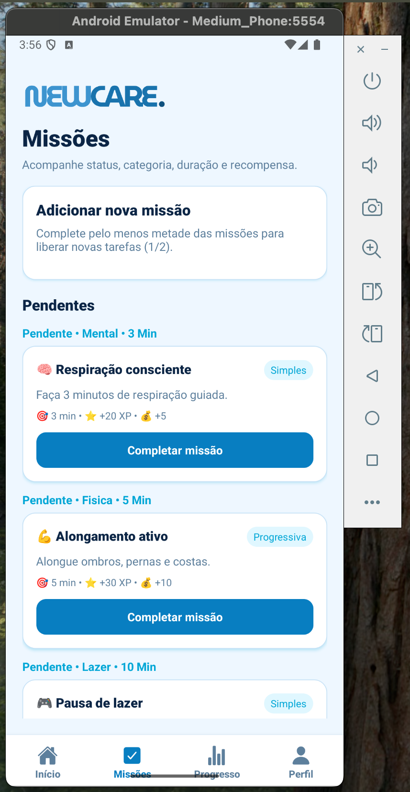 |

| Progresso com XP | Progresso sem XP | Perfil |
| --- | --- | --- |
| 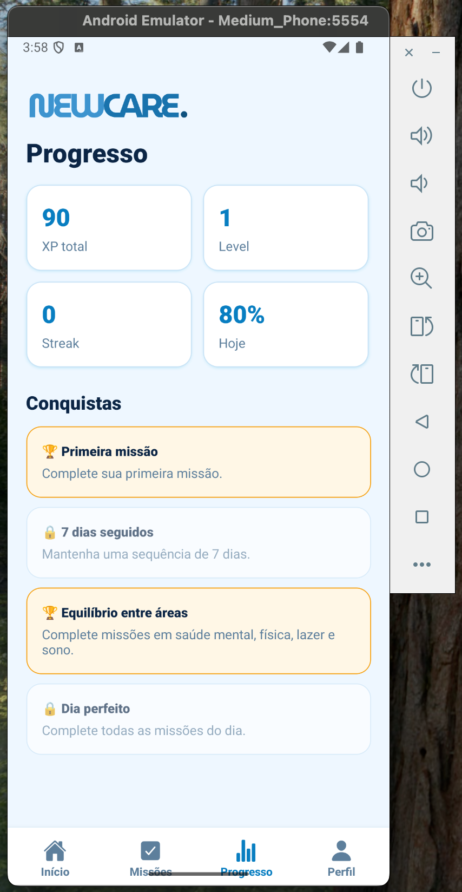 | 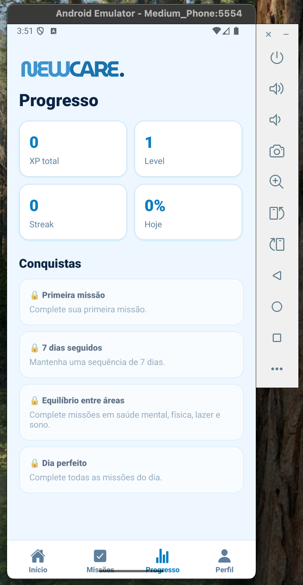 | 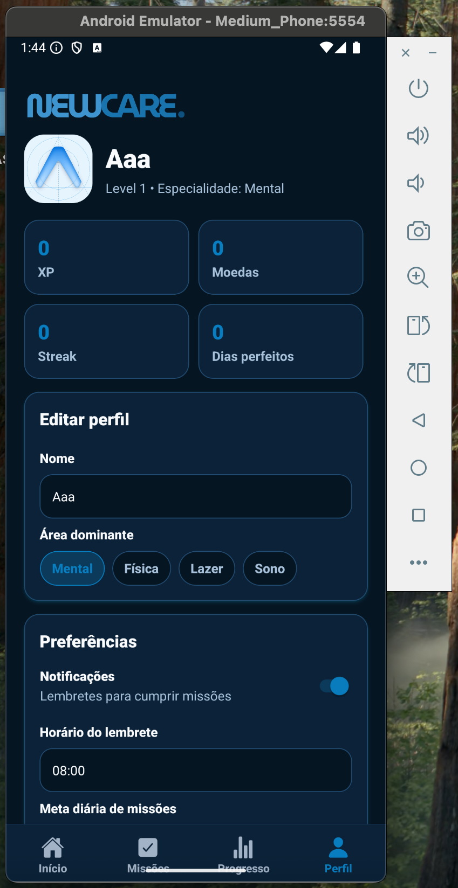 |

### Estados e feedbacks

| E-mail inválido | Senha curta | Missão concluída |
| --- | --- | --- |
| 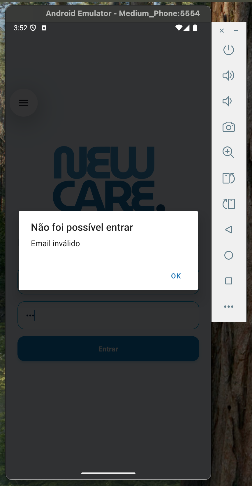 |  | 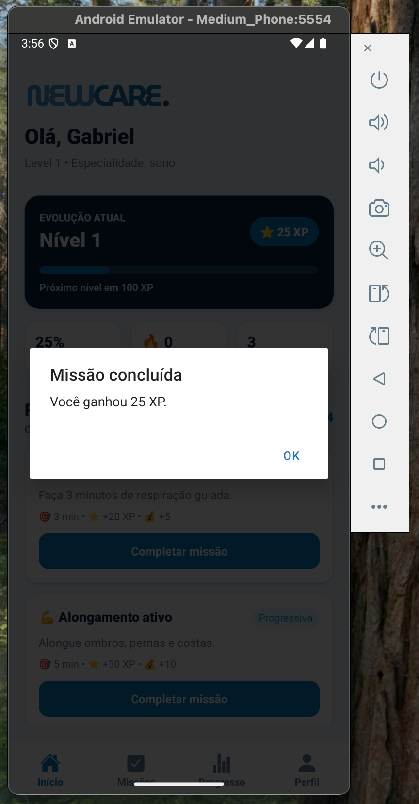 |

| Adicionar missão | Missão adicionada |
| --- | --- |
| 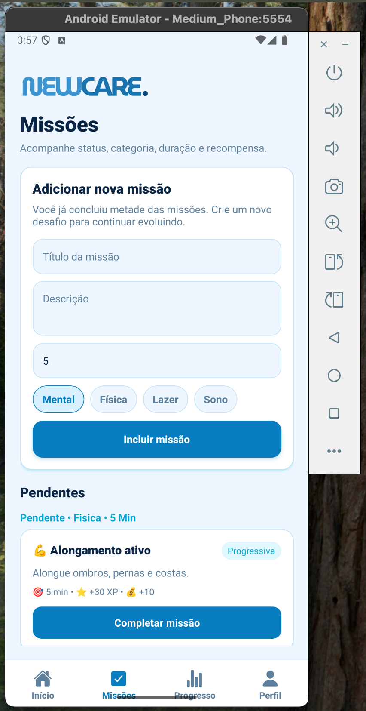 | 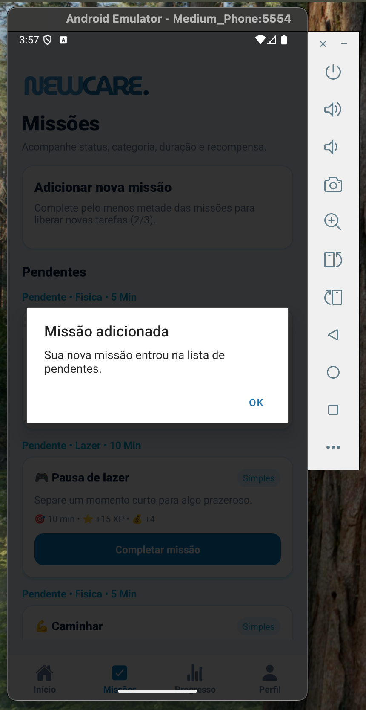 |

### Tema escuro

| Início | Missões | Progresso |
| --- | --- | --- |
| 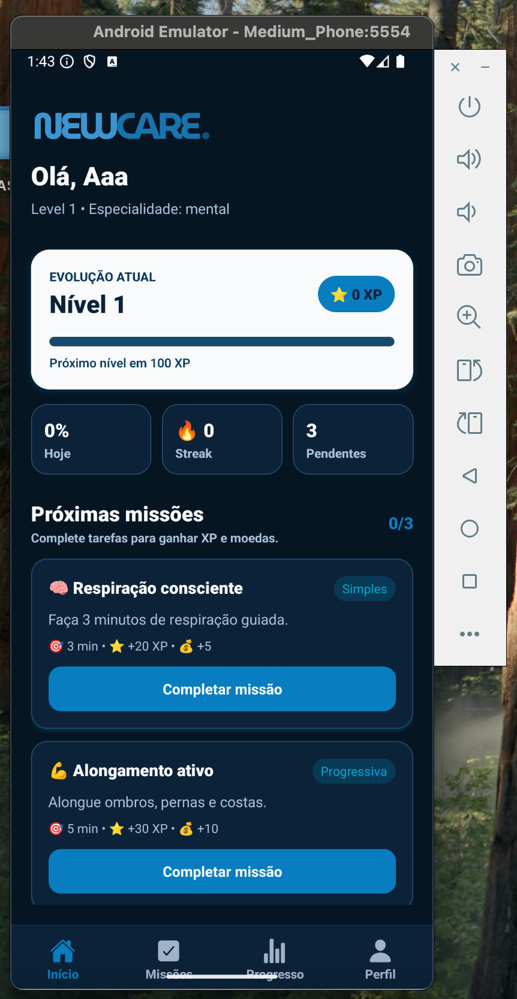 | 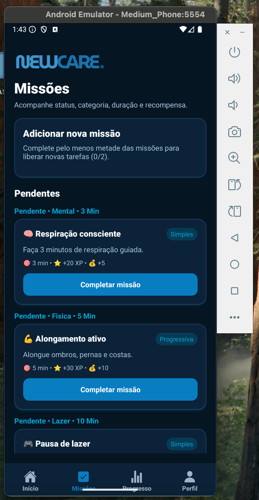 | 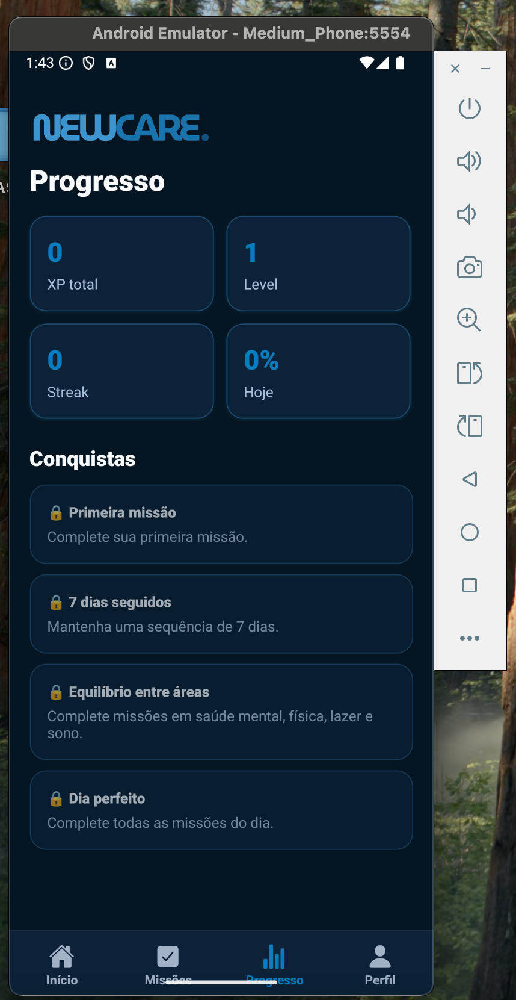 |

---

## Funcionalidades

- Login com validação de e-mail e senha.
- Sessão local persistida com AsyncStorage.
- Onboarding com foco, tempo diário disponível e nível atual.
- Geração de missões personalizadas.
- Missões pendentes, concluídas e adicionadas pelo usuário.
- Liberação de novas missões quando metade das missões atuais foi concluída.
- XP, níveis, moedas, streak e dia perfeito.
- Conquistas desbloqueáveis.
- Perfil editável com avatar, nome, área dominante, preferências e meta diária.
- Barra de progresso da meta diária no perfil.
- Feedback visual para erros, loading, conclusão de missão e criação de missão.
- Tela de carregamento inicial enquanto os dados locais são restaurados.

## Estrutura

```txt
src/
  components/
    Botao.tsx
    CardMissao.tsx
  context/
    AppContext.tsx
  data/
    missoes.ts
  routes/
    AppNavigator.tsx
    types.ts
  screens/
    LoginScreen.tsx
    OnboardingScreen.tsx
    HomeScreen.tsx
    HabitosScreen.tsx
    ProgressoScreen.tsx
    PerfilScreen.tsx
  services/
    storage.ts
  types/
    index.ts
```

## Tecnologias

- Expo
- React Native
- TypeScript
- React Navigation
- AsyncStorage
- ESLint

## Login de teste

O app aceita qualquer e-mail válido e senha com pelo menos 6 caracteres.

Exemplo:

```txt
email: teste@email.com
senha: 123456
```

## Scripts úteis

Validar TypeScript:

```bash
./node_modules/.bin/tsc --noEmit
```

Rodar lint:

```bash
npm run lint
```

Verificar compatibilidade Expo:

```bash
npx expo install --check
```
